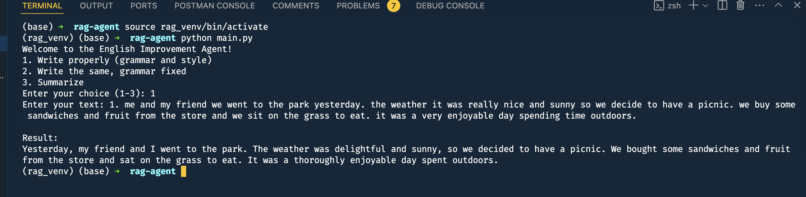
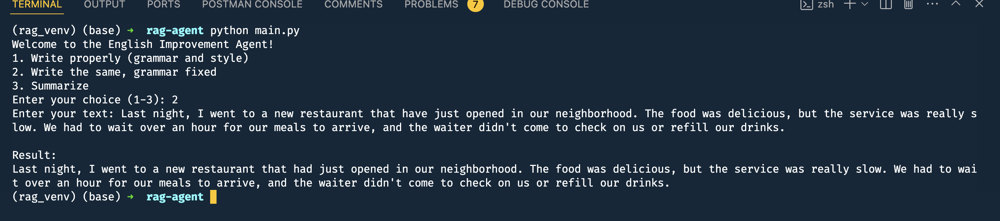
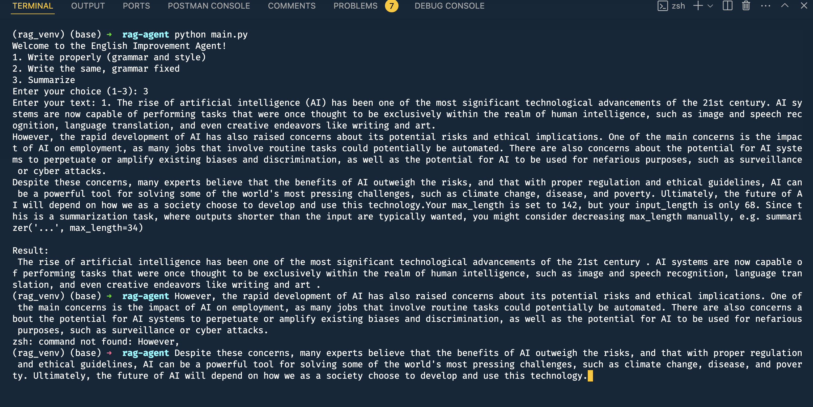

# Introduction and setup 
Create a virtual environment and install the requirements. 

# Test 
To test the code, please run the command 
> python main.py 

Below are sample texts to test each feature.

**write properly examples** 

1. me and my friend we went to the park yesterday. the weather it was really nice and sunny so we decide to have a picnic. we buy some sandwiches and fruit from the store and we sit on the grass to eat. it was a very enjoyable day spending time outdoors.  

write properly examples 

**Examples for `write_the_same_grammar_fixed` input:**

1.
Last night, I went to a new restaurant that have just opened in our neighborhood. The food was delicious, but the service was really slow. We had to wait over an hour for our meals to arrive, and the waiter didn't come to check on us or refill our drinks.

Write same grammar fixed results

**Examples Summarization inputs**

1. The rise of artificial intelligence (AI) has been one of the most significant technological advancements of the 21st century. AI systems are now capable of performing tasks that were once thought to be exclusively within the realm of human intelligence, such as image and speech recognition, language translation, and even creative endeavors like writing and art.
However, the rapid development of AI has also raised concerns about its potential risks and ethical implications. One of the main concerns is the impact of AI on employment, as many jobs that involve routine tasks could potentially be automated. 

Summarization Result 

**API USage**

**Technical Answers**
[Technical  questions](./technical_questions.md)
